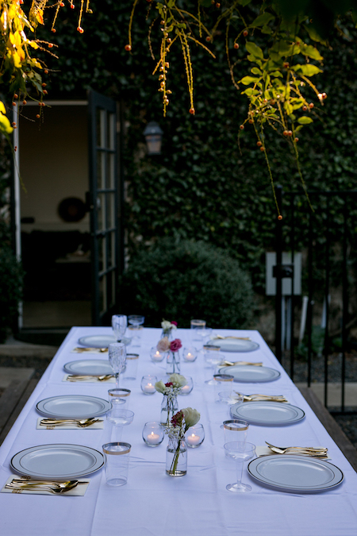

In this addendum to my resume, I will discuss how planning a wedding in 3 months makes me an excellent software leader. 

First of all, to plan a wedding in 3 months means I am someone who takes risks, with a self-imposed tight deadline, and still manages to deliver on time. Since I was having a small wedding, I also knew how to scale back and deliver the MVP. Which as I saw it, included the following:
- Venue
- Food
- Cake (mainly necessary since we love cake)
- Making myself look decent - dress, hair/makeup
- Photographer
- Flowers (minimal)

Now that I had the requirements, it was time to research options, BUT I also needed to make decisions relatively quickly. I hit Google with a plan and defined search criteria to help me narrow the search to the fewest number of options.

#### Venue
Having a small wedding means that a lot of traditional options are overly expensive or unnecessary. So I needed to get creative with my thinking. Traditional venues have high minimums and most of the services weren't needed, so I started exploring restaurants. Although a few were considered, I wanted to have the ceremony and reception at the same place for convenience. Most of the restaurants that we liked didn't have private spaces, and those who did didn't have great ambiance for a ceremony. One late night search led me to a site called Peerspace where you can rent non traditional places. Although it was more geared towards photo shoots or company events, this sounded promising... smaller places, renting by the hour, not bound to other vendor agreements, no minimum number of people, can bring our own alcohol! There were 2 places on the site that I liked, and I made the decision. Booked.

When creating software, I like to research potential options, but make swift decisions on what to use based on a number of criteria, such as cost vs benefit, where cost also includes the cost of implementation, such as the team learning or getting up to speed. And I think creative answers to problems are definitely worth exploring.

#### Food
At my parent's suggestion, I first researched caterers, but found that while food was actually pretty inexpensive, you pay a premium for them to come set it up and serve you. Our wedding was going to have 6 guests. Did we really need that? (No, we did not really need that.) I created a spreadsheet with nearby restaurants that catered and delivered, what appealed to me from their menus, and presented it to my (now) husband. In the name of "research", we went and ate at the one he hadn't been to just to get his sign off. Food came in at around $350, vs the thousands a caterer first proposed. (I'm willing to put in some work to save money.) Plus, we actually over-ordered on purpose and ate leftovers the next day.

Saving money opened another box of things I needed to plan. Where traditional venues and caterers include most things you need, in this DIY approach, I had to think of and consider them myself.

I've never planned an event before, and before doing this, had never spent much time thinking about what would be needed. But I _am_ extremely thorough, detail oriented, and can step through a problem to break it up into smaller pieces and make sure everything is considered/identify edge cases. That's exactly how I approached this situation -- picturing the dinner step by step and writing out everything that would be needed since nothing would be provided. After detailing out the requirements, implementation was easy, I just did a lot of online shopping and checked stuff off the list.

- Bowls and platters for food
- Serving utensils
- Things to keep food hot
- Cooler or bin for drinks
- Dinner plates, cake plates
- Champagne and wine glasses
- Water glasses
- Silverware
- Napkins
- Cake stand
- Tablecloths
- Candles/decorations for table

#### Cake
Before we even thought about a wedding, we knew where we wanted the cake from. We had been to another wedding and had the most incredible banana cake that I still dream about. Unfortunately, it was also 2.5 hours away, and we had enough sense to see that driving 5 hours the day before our wedding was probably a bad idea (they sadly don't ship their cakes). There are other cake places in LA, but one was super close to our venue. We cake tested for fun (highly recommended) and checked it off the list. (Actually, we did this right before "testing" the food at the restaurant we used, because one thing I hate is inefficient errands, and both were close.)

#### Dress
Finding a dress ended up being one of the more challenging elements that took me the longest to find. I can't stress the ridiculousness I would feel wearing a traditional VERY EXPENSIVE over the top dress to a small backyard wedding, for just a few hours. This narrowed down the options considerably. And I got VERY creative, checking basically every website on the internet for all types of dresses, with the only filter that it should be white. In the end, I found a white dress from a designer in London (not a wedding line), with the added bonus that it was tea length, so no alternations needed, AND it was on sale. I had to be able to visualize its potential though -- it had a black sash on it, but I figured I could switch the sash to a white one.

Hair/makeup was relatively easy too, I checked a few places on yelp and cross referenced them with instagram to see some examples. I went with the second person I contacted, mainly because the first one wasn't available at the ideal time. Flowers took the same approach. Photographer was generously gifted to us.

#### Other
Other random stuff you need to think about if you're having a wedding:
- Speakers
- Music selection (at the very least, entrance music)
- Rings (ours were handed down from the family, but needed to get cleaned/resized)
- Marriage license (arguably the only thing you "need")
- Officiant

I also had to plan out the schedule for the day, so I looked up a few quick things about ideal lighting, checked the sunset time for the day, and estimated from there. I also made a detailed day of hour by hour list of events and to do list because why not.

Finally, to even pull off this small wedding, I needed to successfully convince my parents that having a small wedding was the way to go... let's just say I exhibited a combination of excellent communication, persuasion, and conflict resolution skills here.

#### In summary
I am a great decision maker, super organized, able to identify the core elements needed for an MVP/scope effectively, break up large tasks into smaller more actionable parts, see everything needed to plan ahead of time, and gather requirements. I bring an element of creative thinking and out of the box solutions to problems. And communication is a critical part of everything I do.

Oh, and a few days later we cooked and hosted Thanksgiving for everyone, so I researched and planned for that too.
