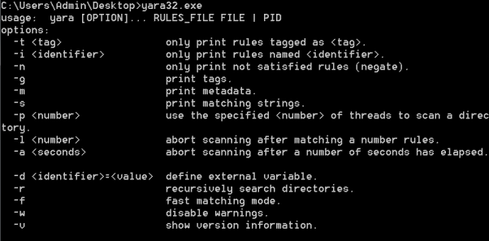
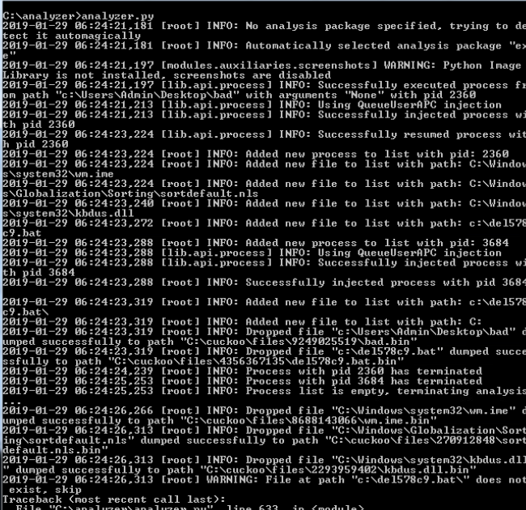
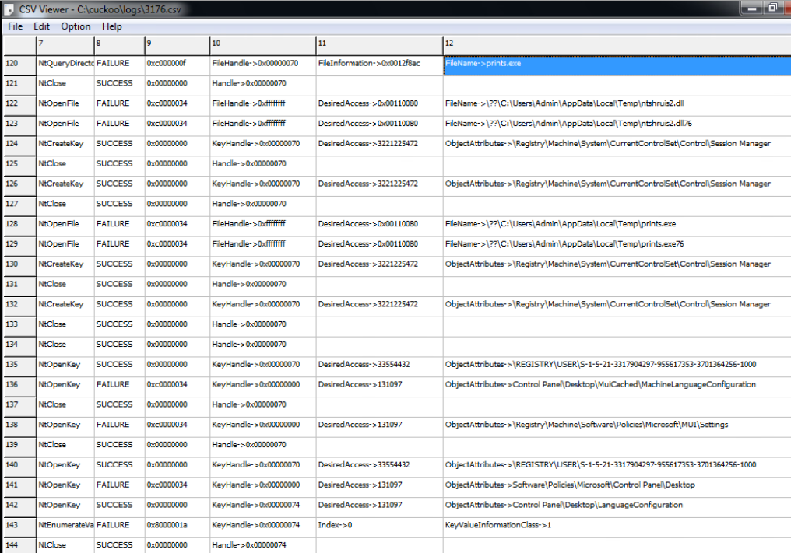
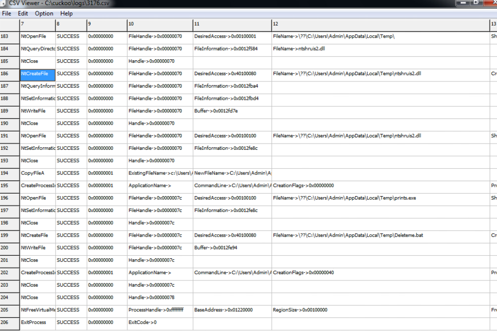
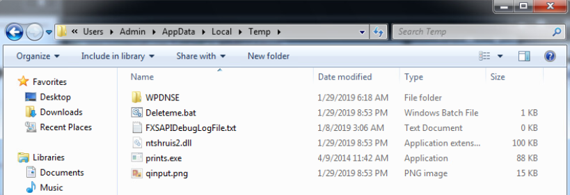
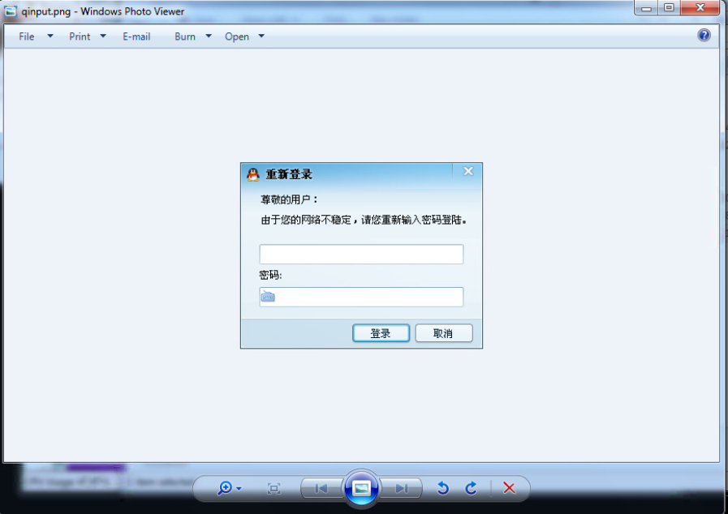
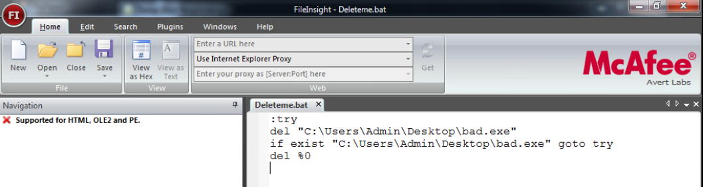
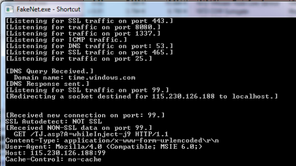

This week focuses on life as a malware researcher and covers how the attack gets into the system, how it typically functions, and how we can defend against it.

#### Spreading malware
##### First contact - Possible Sources
* Email, Instant Messaging
* Malvertising - contaminated ads
* Poisoned search results - Trow up sites based on google trends that would show up high in search results that people would then click on
* Watering hole - go to the place where people mostly go and poison one place
* Physical access - such as USB drives

##### Local Execution
* Autorun - Windows will automatically run software
* Exploitation of a document or file - PDF, plugin, browser
* Reverse psychology/social engineering - "don't click here" "click to claim your prize"

##### Establish Presence
* Tries to blend in and hide (change filenames or datetime stamp, sign files)
* Tries to appear legitimate
* Persists (system startup, application start up, scheduled tasks, etc)

##### Attack
* Harvest information
* Phone home - use web, email, FTP to send data

#### Defenses
* User education
* Block computer ports
* Anti-virus/malware
* Network Firewall/Inreusion Prevention
* Message/Network/Web Reputation
* Host Firewall
* Host IPS
* Access control

##### Anti-malware features
* File Scanning
* Registry and Cookies
* Cloud scanning
* Memory scanning
* Scripts
* Heuristics
* Decomposition
* Configuration: Exclusions, sensitivity, reporting

#### Yara
* language that lets you search for patterns in your scans
* strings - `"in quotes"` params: `nocase`, `wide`, `wide ascii`, `fullword`
* Byte patterns (hex strings) `{}` params: `?` `??` are wildcards `{E2 34 ?? C8 A? FB}`
* conditions are boolean operators, arithmetic, and bitwise `($a == 6 or $b)` `#a == 6 and #b > 10` `$a at 100 and $b at 200`

example:
```
rule myRule {
    strings:
        $a = "win.exe"
        $b = badfile1.exe
        $c = badfile2.exe
    condition:
        $a and ($b or $c)
}
```



#### Automated Analysis
##### Cuckoo
* Automated analysis - You tell it what VMs to run and when you upload a sample, it will run it on the VMs and report the results.
* The host controller of [Cuckoo](http://docs.cuckoosandbox.org/en/latest/introduction/what/) tells each VM how to run the file. It will create the process, inject its DLL (randomly named to avoid detection) into the process, and then trace the Win32 API calls which then it can report back.
* It also reports files being created, deleted, and downloaded by the malware; memory dumps of the malware processes; network traffic trace; screenshots of Windows desktop; full memory dumps of the machines

-----

#### Lab
We are given some sample files to analyze using Cuckoo. I chose to write about the last file. First I use the command line to run Cuckoo on the file:



Cuckoo outputs a series of csv files in the /logs folder that detail everything the malware did. I start here reading the logs since I see the processes happened from "bad" (which is what it's configured to run on):




It looks like the malware tries to find out information about a `prints.exe` file (NtQueryDirectory) as well open the file and another file `ntshruis2.dll` from `C:\Users\Admin\AppData\Local\Temp\`. It also creates a registry key in the Session Manager and tries to open various registry keys. It later successfully creates the `prints.exe` and `ntshruis2.dll` files, as well as a `Deleteme.bat` file in `C:\Users\Admin\AppData\Local\Temp\`.

Looking at the strings, I also see it looking for a user `SOFTWARE\Borland\Delphi\RTL`.

Knowing about the files it creates and where they are stored, I open up the Temp directory before running the malware:



I also see a file called `qinput.png` which I translate using my phone. It looks like a login screen:



Translation:

```Re-register
Dear User:
Since your network is unstable, please login:
[input]
Password:
[input]
[Login] [Cancellation]
```

Looking at the `Deleteme.bat` file, it seems to do exactly what it's named, delete the source of the malware:



Finally, the malware tries to download one file, `TJ.asp`:

