This week focuses on how to investigating security incidents. You should be aware of the best way to investigate it while being careful to preserve evidence.

__Side note - the lecturer talks about the book, [The Cuckoo's Egg](https://www.goodreads.com/book/show/18154.The_Cuckoo_s_Egg). I read it last year and loved it!__

### Types of cases you may investigate
* Fraud
* Intellectual Property
* Hacker Intrusions/Data Breaches
* Inappropriate use of Internet
* Child Exploitation
* eDiscovery supporting Civil or Criminal Litigation

### Stages of Investigation
1. Evidence acquisition
2. Investigation and Analysis
3. Reporting results

### Forensics
* Includes: Identifying, preserving, analyzing evidence and presenting results.
* Could find evidence in network, operating system, databases and applications, peripherals, removable media, human testimony
* To keep in mind: It's not up to you to judge guilt. It's up to you to show what happened. If you think someone is guilty, you look for information to prove your opinion, so it can make you biased while investigating.
* Need to describe results in a way that a judge will understand. Something the lecturer does is ask questions like an attorney to see if there's anything a judge might ask that they can clarify now.
* Always check times and keep records of times.
* Any time you do anything, it affects the memory and could erase something.
* Locard's Exchange Principle - when two things interact, there is always transference of material. Thoroughly document anything you do on a live system.
* Triage - There may be different ways to do something. You should check multiple ways to make sure you can come to the same conclusion.
* You can't log into accounts even if you come across the username and password. You need permission from a judge. It has to be relevant to the case.
* Harddrives are giant and there may be a time limit. You also might get additional harddrives, portable harddrives, cell phones, etc. It takes time to process the data.
* Whitelisting is good to match checksums and verify files are ok and you don't have to waste time investigating them. The person processing the harddrive will do a checksum of the entire harddrive. The first thing you should do is check that to make sure the evidence wasn't tampered with.

### Incident Response Process
0. Incident Response Team Preparation
1. Incident Detection
2. Initial Response
3. Formulate Response Strategy
4. Investigate the Incident
4a. Data Collection
4b. Forensic Analysis
4c. Perform Non-Forensic Investigation
5. Document Findings
5a. Administrative Action

### APT Case Evidence
* Reconnaissance: Firewall/IPS logs
* Delivery - Email Gateways logs, proxy logs, internet history, Java-IDX files
* Exploitation - Windows Event logs, crash dump files
* Installation - $MFT, memory dump registry, prefetch-files
* Command and Control - Memory dump, firewall logs, proxy logs, netflow
* Actions on Objectives - $MFT, memory dump registry, prefetch files, netflow, remote tools

*Initial Response - Shutting off the machine can destroy evidence, but you should pull network cable or block port (attacker may be on network still, even watching you!)*

#### Order of Volatility - RFC 3227
- Gather evidence in specific order, capturing the most volatile things first
* System memory
* Temporary file systems
* Process Table and Network Connections
* Network Routing Information and ARP cache
* Forensices Acquisition of Disks
* Remote Logging and monitoring data
* Physical config and network topology
* Backups
* Non volatile data (Time/Data stamps, event logs, web/application logs, registry)
* Relevant logical files (Unknown executables, attacker tools, any other files related to incident)

#### FTK Imager
* Easy free tool, to dump memory, but leaves an imprint in memory so it's better to do with commands.
* Note - Never install forensics tools on a suspect's computer, because you're influencing!
* Capture memory - don't store it on desktop. usually will want to store on a shared network. Naming - operation + serial number or date + .mem. You can decide to include pagefile
* Add evidence item - you can copy external sources
* Take a look - find root -> $MFT master file table. You can export it from this tool
* Create disk image, pick encase (E01) as format or raw (DD)

#### Physical memory - system memory (RAM) - short term memory
You can get...
* All running processes at time of snapshot
* All loaded modules and DLL's including malware
* Running device drivers, including rootkits
* Open files for each process, including path to file on disk
* Open registry keys for each process
* Open network sockets including IP address
* Decrypted versions of data
* Contents of windows
* Keystrokes
* Email attachments, file transfers
* Cryptographic key material
* WEP and WPA wireless keys
* Usernames/passwords

#### Analyzing Memory Dumps
* Look for a printable string
* Reconstruct internal data structures
* Search for static signatures of kernal data structures

#### Volatility
* Advanced memory forensics framework
* Plugins - malfind, csrpslist, orphan threads, PSList, PSScan, svcscan, ldrmodules, impscan, apihooks, idt, gdt, callbacks, driverirp, psxview, ssdt_ex, ssdt_by_threads
* Yara - Malware plugins for Volatility

```
volatility.exe -h    // shows options
volatility.exe -f nameofmemorydump pluginname
volatility.exe -f nameofmemorydump --profile=Win7SPOx86 pluginname
```


*Plugins:*
* `imageinfo` - tells us windows operating systems. image date and time - when you took the memory dump
* `psscan`
* `dlllist -p <processid>`
* `netscan`
* `Deskscan` - 
* `Getsids` - see which user rights the malware was running


#### Windows Registry
* `regedit` in run window
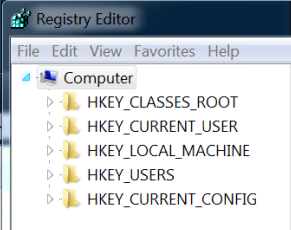

* HKEY (handle to a key). Most important are `HKEY_USERS` (HKU) - profile of users, `HKEY_LOCAL_MACHINE` (HKLM)

#### Timeline Analysis
* $MFT (master file table) - check timings of when things are changed
`volatility.exe -f nameofmemorydump --profile=Win7SPOx86 mftparser --output=body >> mftparser.txt`
* Reg-Ripper
* Volatility timeline
`volatility.exe -f nameofmemorydump --profile=Win7SPOx86 timeliner --output=body >> timeline.txt`

#### Files and Directory Analysis
Things to check:
* pagefile.sys, index.dat, etc
* Windows event logs (Application, System, Security, DNS)
* IIS/webserver/FTP logs/URL Scan - the web could be a point of entry
* Windows firewall log (%windir%\pfirewall.log)
* setupapi.log - installation of applications and devices
* schedlgu.txt - scheduled tasks
* Application configuration files and logs
* Antivirus/IDS/IAS/ISA Server logs
* Prefetch folder `strings C:\WINDOWS\Prefetch\PWDUMP2.exe`
* Evidence of malware, rootkits, etc
* System restore points
* Hybernation file
* Crash-dump files
* LNK files
* Shell-bag - when you open a window
* HKEY_USERS for internet browsing history, last accessed files
* Autorun locations
* MRU lists
* UserAssist
* USB devices
* Geolocation

#### Data Recovery
* When you delete files, the markers in memory for the data are deleted, but not always the data
* You can use a program to search for the data such as PhotoRec. Header files start with certain keys, so it looks for starting with JOJA and footer has xyz.

----

### Lab
We are then given a challenge, a Korean defector was caught with a USB stick that we need to investigate.

First I mounted the contents of the drive to a drive on my VM using OSFMount:
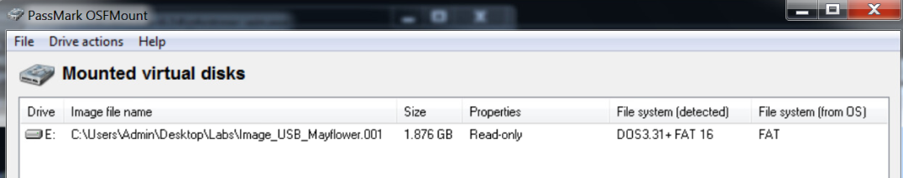

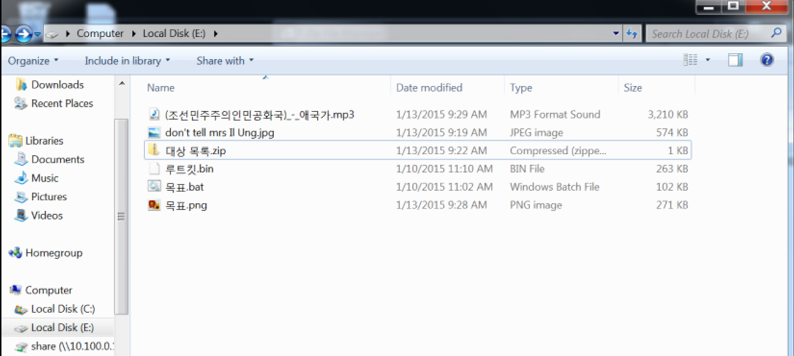

Next I used the Google Translate app on my phone to take a picture of the files and translate them:
* Democratic People's Republic of Korea - country to.mp3
* Target list.zip
* Rootkin.bin
* Target.bat
* Goal.png


##### Targets

Looking at the contents of the jpg file as strings, I found the password:

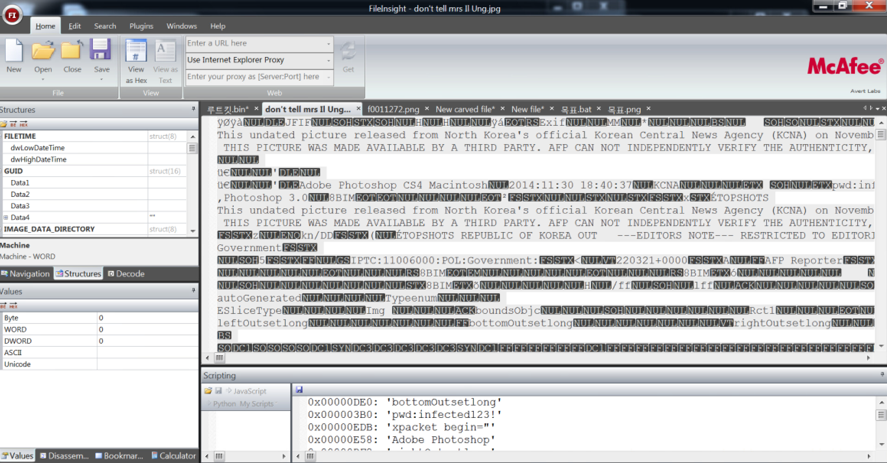

Which I used to unzip the zip file:

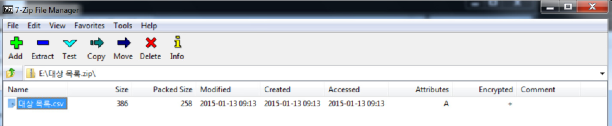

And read its contents, the list of targets! (included S-Oil Onsan Refinery, GS Caltex Yeosu Refinery)

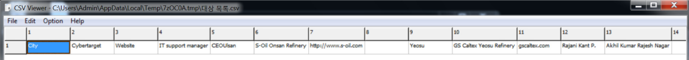


##### Malware

Looking at the strings of the .bin file, we see `cmd.exe /q /c net share shared$=%SystemRoot% /GRANT: everyone, FULL`
It looks like it is executing a command to create a network share to the system root and give full permissions to everyone. /q is for quiet mode so it's undetected.

When running the malware, the first thing I see is a file called igfxtrayex.exe that is created. By reading and googling strings and using the tools from last week, I think the malware is adding itself as a service to Windows Schedule Management Service (WinsSchMgmt). It looks like it creates and runs multiple files including dpnsvr16.exe and net_ver.dat. It also seems to change soooo many registry keys (just a small sub section below):

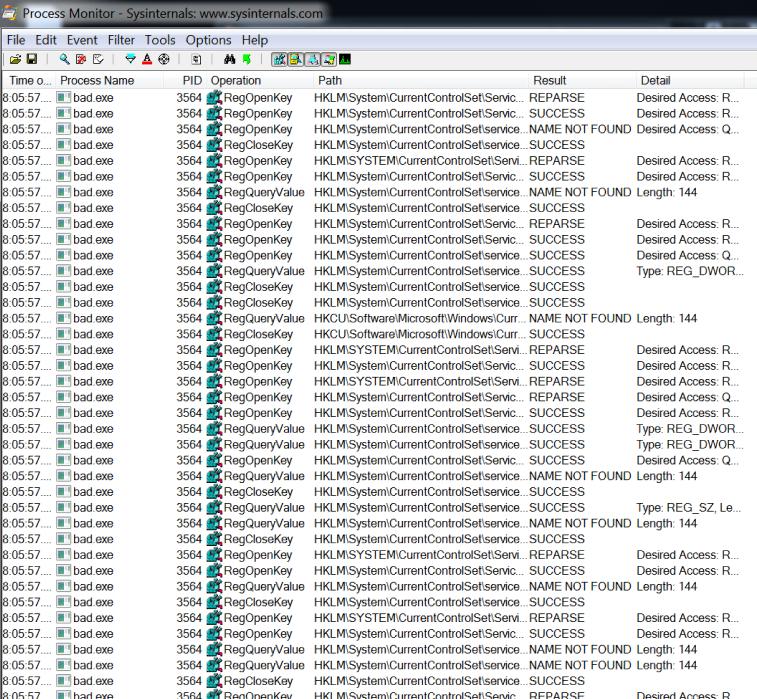


It also tries to connect to a bunch of IPs starting with 43.130.141:

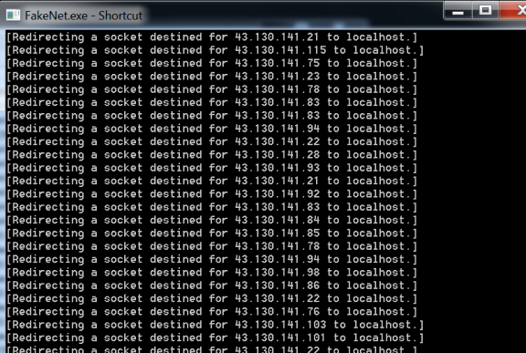

It also seems like it may be loading a window and drawing text to it, based on calls to BeginPaint, DrawText, and LoadIcon.

##### Deleted files

The following files were deleted (found using PhotoRec):

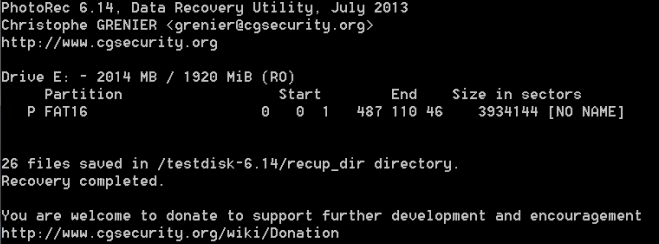

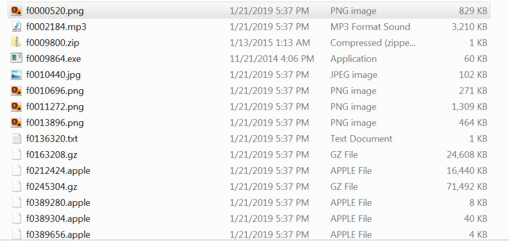
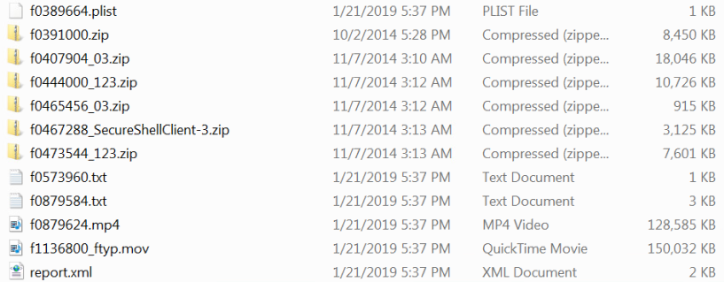


##### Username/passwords

After opening a file recovered via PhotoRec, I searched in the .bin file for the string 'spe' (lecture hint) and found the following (at offset value 0x3ebbd):

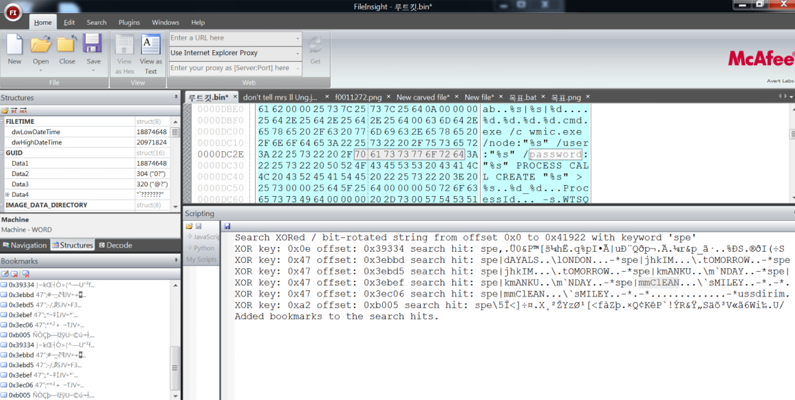

##### Strategy to Target

DO NOT RUN THIS FILE! It will destroy your computer. 😱

